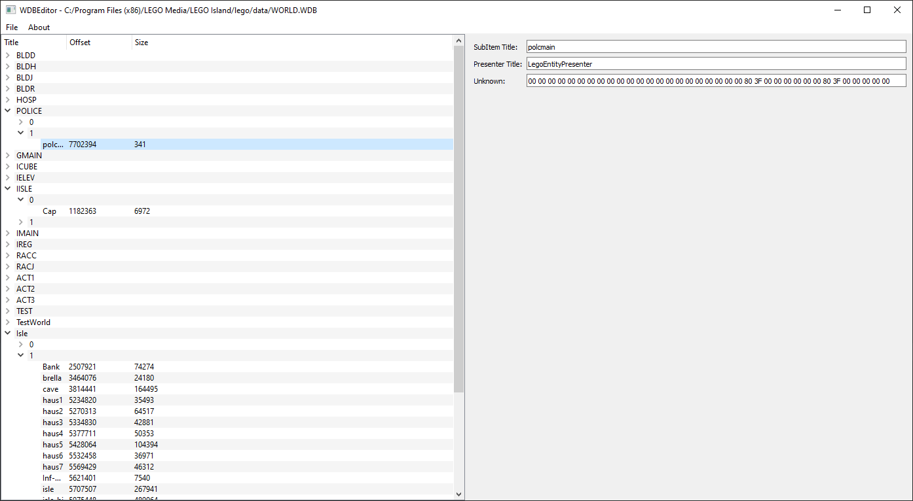

# WDBEditor

This repository contains a very primitive application for interacting with World Database Files (Otherwise known as WDB files) used in the original Lego Island game.

## Status

Files can be opened, and saved again. The application also only reads and writes the first section of the file (Groups, Subgroups and Subitems), while ignoring most of the actual assets.
Any edits made to the parameters shown in the application are saved and can be read in back again.
The loose GIF chunk is currently not reconstructed yet, and is not yet visible in the UI. Rather, the bytes are simply copied 1:1 from input to output.

## TODO
1. ~~Add Serialization logic so files can be saved again after editing~~ (The fields that are being parsed are being reconstructed correctly, however, not all data is being parsed currently, of course)
2. ~~Add UI support for more missing fields (Unknown 37 bytes in presenter info, for instance)~~ (Unknown field has been added, data chunks come later)
3. ~~Add support for actually editing fields, rather than just showing them~~ (All currently parsed fields can be edited, and are serialized correctly)
4. ~~Make some changes to main window so its initial size, as well as the division between it and the parameter view are more acceptable.~~
5. ~~Fix bug related to an extra NULL terminator being parsed and present in edit fields?~~
6. ~~Parse loose GIF Chunk~~ (We currently just read the straight binary data, and don't parse the content)
7. ~~Serialize loose GIF Chunk~~ (We currently just dump the full binary data, without parsing the contents)
8. ~~Add CI pipeline~~
9. ~~Parse loose GIF Chunk contents~~
10. ~~Show loose GIF Chunk in UI~~
11. Allow exporting of GIFs from loose GIF chunk
12. Serialize loose GIF Chunk (Again, dumping raw binary data became impossible when we started parsing it)
13. Parse loose model Chunk
14. Serialize loose model Chunk
15. Parse loose model chunk contents
16. Show loose model Chunk in UI
17. Show binary data for per-subitem data
18. Parse per-subitem data (Without reconstruction, but with 1:1 binary copy into the saved file)
19. Reconstruct per-subitem data (Rather than just copying the bytes 1:1)
20. Add support for replacing actual assets (This will be worked out further when I get closer to this)

## Useful Resources
These are some resources I found useful while working on this tool.

- fileformats.archiveteam.org has [a very nice write-up](http://fileformats.archiveteam.org/wiki/Lego_Island_World_Database) on the .wdb file format.
- [WDBRipper](https://github.com/LiamBrandt/WDBRipper/) is a Python tool that can be used to extract a good chunk (Around 400/600 on my system at the time of writing) of the assets contained in WORLD.wdb
