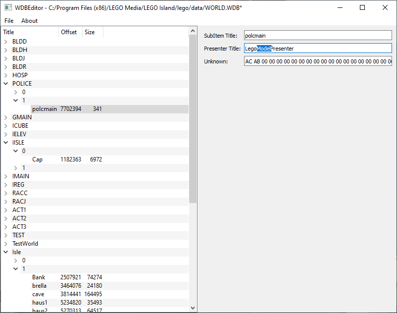

# WDBEditor

This repository contains a very primitive application for interacting with World Database Files (Otherwise known as WDB files) used in the original Lego Island game.

## Status

Files can be opened, and saved again. The application also only reads and writes the first section of the file (Groups, Subgroups and Subitems), while ignoring most of the actual assets.
Any edits made to the parameters shown in the application are saved and can be read in back again.

## TODO
1. ~~Add Serialization logic so files can be saved again after editing~~ (The fields that are being parsed are being reconstructed correctly, however, not all data is being parsed currently, of course)
2. ~~Add UI support for more missing fields (Unknown 37 bytes in presenter info, for instance)~~ (Unknown field has been added, data chunks come later)
3. ~~Add support for actually editing fields, rather than just showing them~~ (All currently parsed fields can be edited, and are serialized correctly)
4. ~~Make some changes to main window so its initial size, as well as the division between it and the parameter view are more acceptable.~~
5. ~~Fix bug related to an extra NULL terminator being parsed and present in edit fields?~~
6. Add support for the loose GIF chunk
7. Add support for the loose model chunk
8. Show binary data for per-subitem data
9. Parse per-subitem data (Without reconstruction, but with 1:1 binary copy into the saved file)
10. Reconstruct per-subitem data (Rather than just copying the bytes 1:1)
11. Add support for replacing actual assets (This will be worked out further when I get closer to this)
